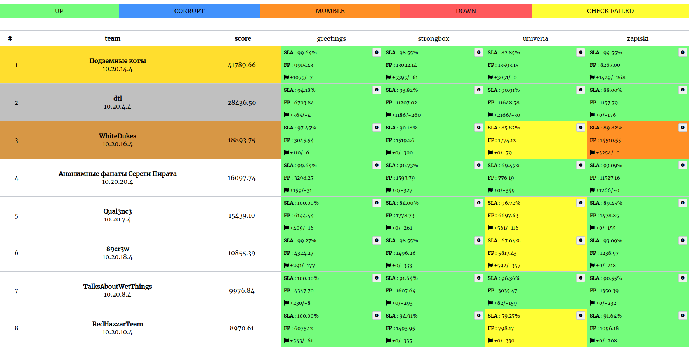

# underground_24_12
Repository contains source code of services, checkers and sploits.

## Results

## Services

| Service | Language | Checker | Sploits | Authors |
|---------|----------|---------|---------|---------|
| **[greetings](services/greetings/)** | Go/nuxt | [Checker](checkers/greetings/) | [Sploits](sploits/greetings/) | [@gusyaross](https://github.com/gusyaross) |
| **[strongbox](services/strongbox/)** | Python | [Checker](checkers/strongbox/) | [Sploits](sploits/strongbox/) | [@gusyaross](https://github.com/gusyaross) |
| **[univeria](services/univeria/)** | NodeJS | [Checker](checkers/univeria/) | [Sploits](sploits/univeria/) | OmCTF dev |
| **[zapiski](services/zapiski/)** | C | [Checker](checkers/zapiski/) | [Sploits](sploits/zapiski/) | [@pc-rockefeller](https://github.com/pc-rockefeller) |

## Infrastructure

- DevOps: [@lucky624](https://github.com/lucky624)
- Checksystem: [RuCTF-checksystem](https://github.com/HackerDom/checksystem)
