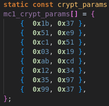
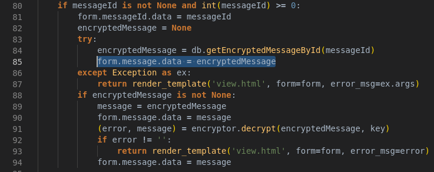
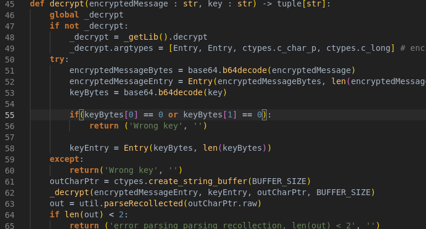

# Сервис zapiski

Все .c файлы, которые остались в папке сервиса на момент проведения соревнований были использованы при компиляции "encryptor.so". Единственный файл, который отсутствал, называется "encryptor.c". В нем были описаны функции "encrypt" и "decrypt".

## Возврат зашифрованных сообщений и нераскрываемые эксплоиты

Сервис возвращает зашифрованное сообщение, если введенный ключ был неверным. 
*Строго говоря, возможны случаи, когда при введении заведомо неверного ключа программа вернет неверно расшифрованное сообщение. Об этом позже*.

Это дает на сразу 2 возможности украсть флаг и не раскрыть эксплоит.

Следующие 2 способа подразумевают, что у нас есть зашифрованное сообщение.

**Первый способ**

Программа зашифровывает/расшифровывает сообщение функциями, описанными в "message1.c".

Проанализировав файл можно заметить, что само по себе шифрование от ключа не зависит, и сообщение зашифровывается при помощи следующих пар {key, step}:

Пользуясь этими значениями можно расшифровать флаг пробегая по зашифрованному сообщению. Данный способ хоть и рабочий, занимает очень много времени.

**Второй способ**

Сообщение зашифровывается таким образом, чтобы шли 2 значения, по одному байту на каждое: *ключ* и *шаг*. Дальше выделяется 4 байта на магическое число - XOR зашифрованная этими *ключем* и *шагом* строка *MNL1*. После этого идет последовательность байтов зашифрованного сообщения, которая нам в данном случае *почти* не интересна.

Ключ зашифровывается подобным образом с одним отличием: в данном случае *ключ* и *шаг* --- это произведе *ключа* сообщения на *ключ* ключа (извините за тавтологию :D) и *шага* сообщения на *шаг* ключа соответственно.

В данной ситуации очень просто подделать начало ключа, нужно всего лишь чтобы произведение *ключей* и *шагов* сообщения и ключа расшифровывали магию в *MNL1*. Для этого зануляем первые 2 байта ключа. После этого XOR расшифрование "игнорируется", и мы можем просто записать незашифрованную магию как *MNL1*.

Следующий байт ключа --- номер сообщения, которое мы хотим расшифровать. При шифровании исходного сообщения к нему добавляется от 3 до 8 предшествующих ему случайно сгенерированных сообщения, и от 3 до 8 после. Из-за этого мы не имеем единственного ключа ко всем зашифрованным сообщениям. Ставим этот байт от 3 до 8.

Следующие байты никакого смысла в себе не несут, их можно не писать.

Таким образом получаем следующий набор ключей:

{*b'\x00\x00MNL1\x03'*, *b'\x00\x00MNL1\x04'*, ..., *b'\x00\x00MNL1\x07'*}

Используя данный набор ключей мы получим расшифрованный флаг.

Имея зашифрованное сообщение и набор ключей можно расшифровать флаг обращаясь к локальному "encryptor.so" и не раскрыть уязвимость.

## Другие эксплоиты

Посылая ключи, описанные выше, заранее зашифрованные в Base64, получим флаг.

## Защита

**Убрать вывод зашифрованного сообщения**

Удалить данную строчку в "zapiski.py" из функции "view"

**Запретить посылать посылать ключи, у которых первые 2 байта нулевые**

Программа не может сгенерировать ключ, у которого *ключ* и *шаг* равны нулю, поэтому их нужно запретить посылать.

Простым решением будет добавление подобной проверки в "encryptor.py" в функцию "decrypt"

